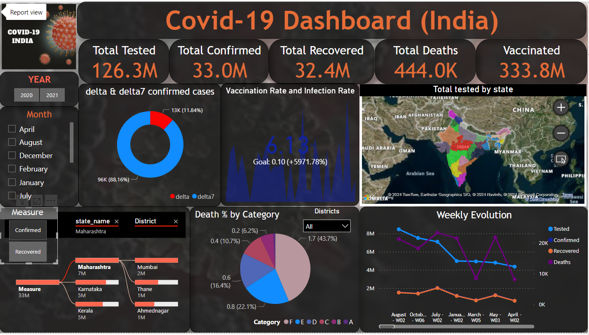

# COVID - 19 ANALYSIS OF INDIA 

## Overview
This project involves the analysis of a dataset using Python and Power BI to create a comprehensive dashboard. The dashboard provides insightful visualizations and analytics that help in understanding the Covid - 19 impact particularly in India.

## Table of Contents
- [Project Description](#project-description)
- [Tech Stack](#tech-stack)
- [Dashboard Overview](#dashboard-overview)
- [Video Presentation link](#video-presentation-link)
- [Project PPT link](#demo-link)

## Project Description
The objective of this project is to analyze the COVID-19 situation in India by leveraging data science techniques and interactive visualizations. Our goals are to fetch COVID-19 data from reliable sources and preprocess it to ensure accuracy and consistency. Enabling in-depth analysis of weekly case trends, testing ratios, and mortality rates across different regions.

## Tech Stack
- *Power BI*: For data visualization and dashboard creation.
- *Python*: For data cleaning and preprocessing.
- *Pandas*: A Python library used for data manipulation and analysis.
- *Jupyter Notebook*: For interactive data analysis and documentation.

## Dashboard Overview

The Power BI dashboard includes the following key features:
- *Summary Statistics*: Provides an overview of the total tested, confirmed cases of the variant, deaths and vaccinations over the states of India.
- *Trend Analysis*: Visualizes trends over year, month and week for various metrics .
- *Comparative Analysis*: Compares different metrics such as recovered with confirmed cases and many other within the data.
- *Interactive Filters*: Allows users to filter data based on specific criteria as year, month and key metrics.
- *Detailed Views*: Offers detailed insights into specific areas of tested, deaths, recovered, confirmed cases and delta variants as well.

## Video Presentation Link
[Youtube-Link](https://youtu.be/Mkt6lS3X5Sw)

## Project PPT Link
[PPT-Link](https://drive.google.com/file/d/1uQLtK-ZTu5hQZ7c2VMQBvsuXzZupsfcO/view?usp=sharing)

---

For any questions or feedback, please feel free to open an issue or contact the project maintainer.

Happy analyzing!

---

